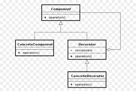

## 3. Padrões comportamentais

---

### 3.8 Visitor

### 3.8.1 Introdução 

Trata-se de um padrão de design comportamental que permite que você separe algoritmos dos objetos nos quais eles operam.

### 3.8.2 Exemplo abordado:

Para tal padrão de projeto, implementei um exemplo relacionado a três tipos de usuário de um sistema de hotelaria

### 3.8.3 Diagrama de classe do exemplo

